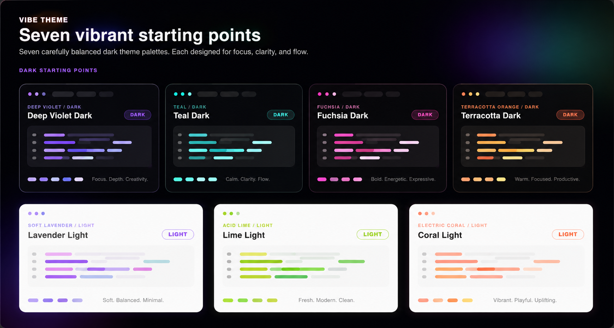

# Vibe Theme

Vibe Theme is a family of dark themes for Visual Studio Code built around 2026's most relevant design trends — from SaaS dashboards to earthy, organic palettes.

## Start Here

- `Mood Mode Dark`: deep zinc blacks with violet and cyan — the 2026 SaaS dashboard standard.
- `Transformative Teal`: deep navy with teal and sky blue — clean, resilient, Earth-forward.
- `AI Iridescence`: near-void dark with fuchsia-to-violet iridescence and emerald pops.
- `Warm Biophilic`: charcoal browns with terracotta and amber — organic and easy on the eyes.
- `Soft-Tech Pastel`: deep purple-black with lavender and rose — calm focus for long sessions.
- `Midnight Moss`: forest blacks with acid moss green and sage — strong contrast, terminal feel.
- `Arid Stone`: desert canyon darks with electric coral and sand dune accents.

## Install

1. VS Code Marketplace: <https://marketplace.visualstudio.com/items?itemName=HectorMendoza.vibe-theme>
2. VS Code Quick Open: `ext install HectorMendoza.vibe-theme`

## Shipped Themes

- `Vibe Theme`
- `Vibe Theme - Mood Mode Dark`
- `Vibe Theme - Transformative Teal`
- `Vibe Theme - AI Iridescence`
- `Vibe Theme - Warm Biophilic`
- `Vibe Theme - Soft-Tech Pastel`
- `Vibe Theme - Midnight Moss`
- `Vibe Theme - Arid Stone`

## Color Palettes

| Theme | Background | Accent | Secondary |
|---|---|---|---|
| Mood Mode Dark | `#09090B` | `#8B5CF6` | `#06B6D4` |
| Transformative Teal | `#0F172A` | `#2DD4BF` | `#38BDF8` |
| AI Iridescence | `#0a0a12` | `#e879f9` | `#818cf8` |
| Warm Biophilic | `#1C1917` | `#FB923C` | `#F59E0B` |
| Soft-Tech Pastel | `#13111a` | `#C084FC` | `#F9A8D4` |
| Midnight Moss | `#0D1410` | `#A3E635` | `#4ADE80` |
| Arid Stone | `#1A1208` | `#FF6B35` | `#D97706` |

## Feedback & Contributions

Found a bug or have a suggestion? Open an issue on [GitHub](https://github.com/hector-mendoza/vibe-theme).

## Links

- Source: <https://github.com/hector-mendoza/vibe-theme>
- Issues: <https://github.com/hector-mendoza/vibe-theme/issues>
- Changelog: <https://github.com/hector-mendoza/vibe-theme/blob/main/CHANGELOG.md>
