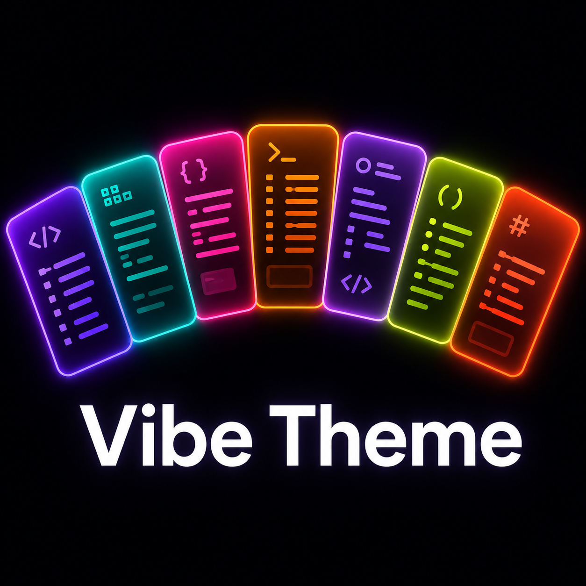

# Vibe Theme

A collection of 7 dark themes for Visual Studio Code built around 2026's most relevant design trends — from SaaS dashboards to earthy, organic palettes.

## Themes

### 🟣 Mood Mode Dark
The 2026 standard for dashboards and SaaS. Deep zinc blacks with violet highlights and cyan teal accents — designed dark from the ground up, not adapted from light.

### 🩵 Transformative Teal
Inspired by WGSN/Coloro's Color of the Year 2026. Deep navy base with transformative teal and sky blue accents — clean, resilient, and Earth-forward.

### ✨ AI Iridescence
For tech and launch pages. A near-void dark background with fuchsia-to-violet iridescent highlights and emerald pops — computational and hyperrealistic.

### 🟠 Warm Biophilic
Charcoal browns and warm obsidian replace harsh blacks. Terracotta orange and amber ochre accents create an organic, cozy feel that's easy on the eyes.

### 🪻 Soft-Tech Pastel
Soft lavender and rose pastels over a deep purple-black background. Sophisticated contrast without visual fatigue — calm focus for long sessions.

### 🌿 Midnight Moss
Deep forest blacks with acid moss green and sage accents. Strong contrast that feels like a dev terminal in the middle of the woods.

### 🪨 Arid Stone
Desert canyon darks with electric coral and sand dune accents. Bold and warm — a palette inspired by canyon landscapes.

## Installation

1. Open **Extensions** in VS Code (`Ctrl+Shift+X` / `Cmd+Shift+X`)
2. Search for `Vibe Theme`
3. Click **Install**
4. Open the Command Palette (`Ctrl+Shift+P` / `Cmd+Shift+P`)
5. Select **Preferences: Color Theme**
6. Choose any of the **Vibe Theme** variants

## Color Palettes

| Theme | Background | Accent | Secondary |
|---|---|---|---|
| Mood Mode Dark | `#09090B` | `#8B5CF6` | `#06B6D4` |
| Transformative Teal | `#0F172A` | `#2DD4BF` | `#38BDF8` |
| AI Iridescence | `#0a0a12` | `#e879f9` | `#818cf8` |
| Warm Biophilic | `#1C1917` | `#FB923C` | `#F59E0B` |
| Soft-Tech Pastel | `#13111a` | `#C084FC` | `#F9A8D4` |
| Midnight Moss | `#0D1410` | `#A3E635` | `#4ADE80` |
| Arid Stone | `#1A1208` | `#FF6B35` | `#D97706` |

## Feedback & Contributions

Found a bug or have a suggestion? Open an issue on [GitHub](https://github.com/hector-mendoza/vibe-theme).
